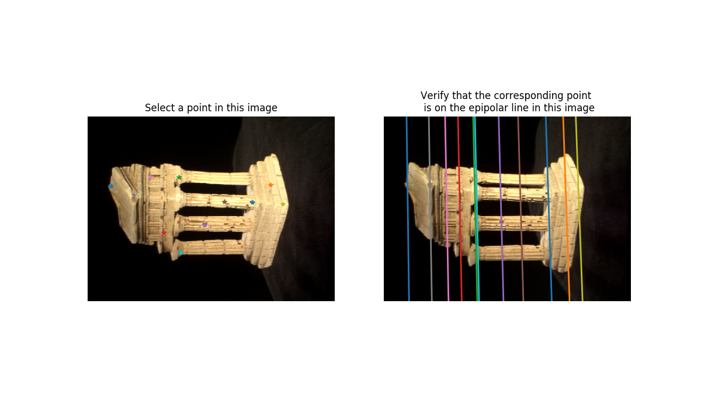
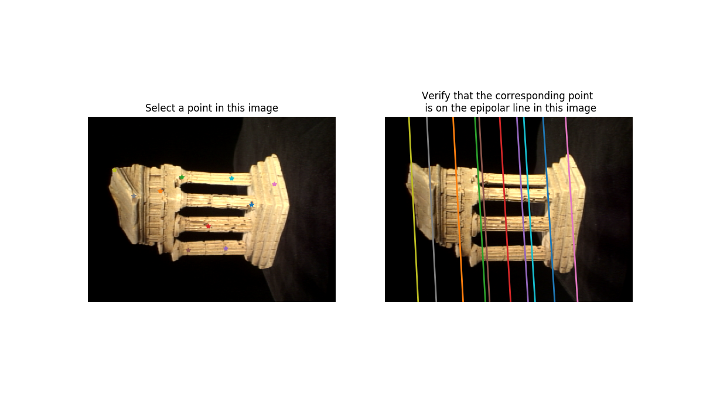
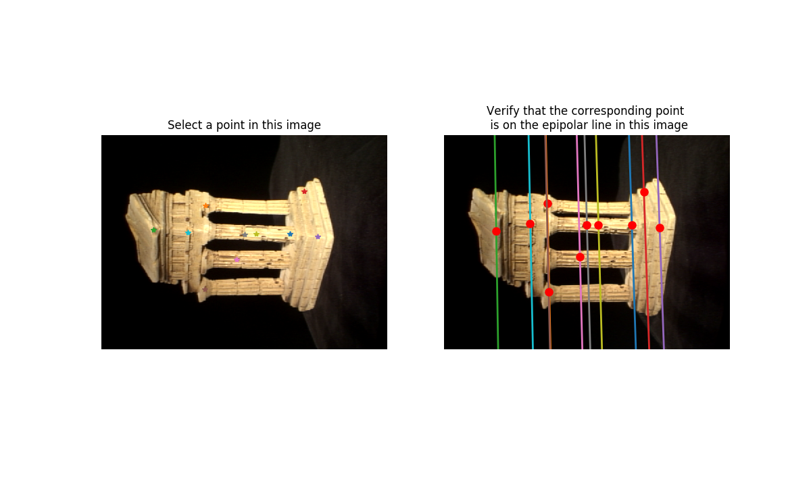
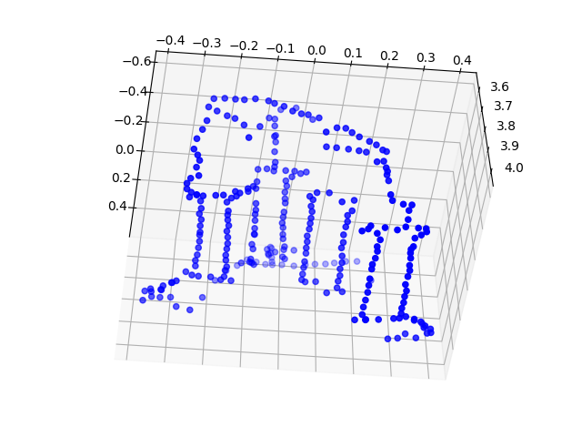
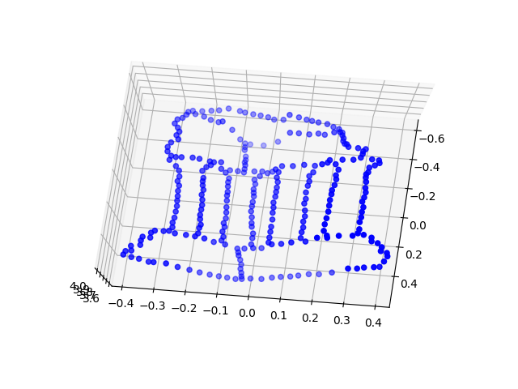
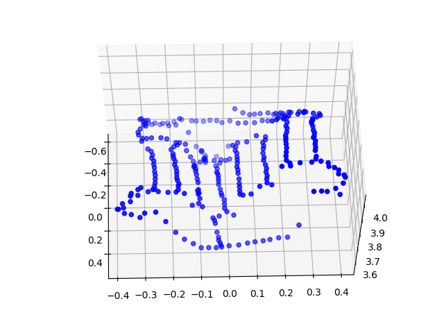
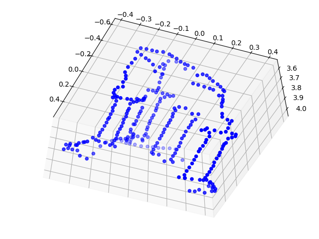

# 3D Reconstruction & Bundle Adjustment

-----------------------

Keypoint estimation for fundamental matrix estimation using 8 point algorithm

-----------------------

Keypoint estimation for fundamental matrix estimation using 7 point algorithm

-----------------------

Epipolar correspondence search on epipolar line

-----------------------

3D Reconstruction results

   

-----------------------
